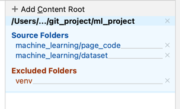
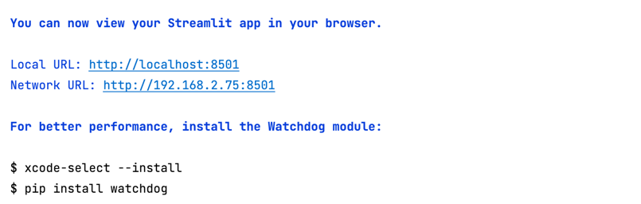

## 答辩课题：租房价格预测
### 代码结构介绍
    - dataset 数据集存储位置
    - exp1, exp2, exp3 三次实验代码
    - output 实验输出结果，具体参考 output下readme.md文件
    - page_code 模型上线代码
### streamlit 运行步骤
    - 将page_code,dataset作为资源文件加入文件结构中，参照下图

    - 在工程根目录下执行
    streamlit run ./machine_learning/page_code/首页.py
    - 效果如下，点击链接打开网页

    

